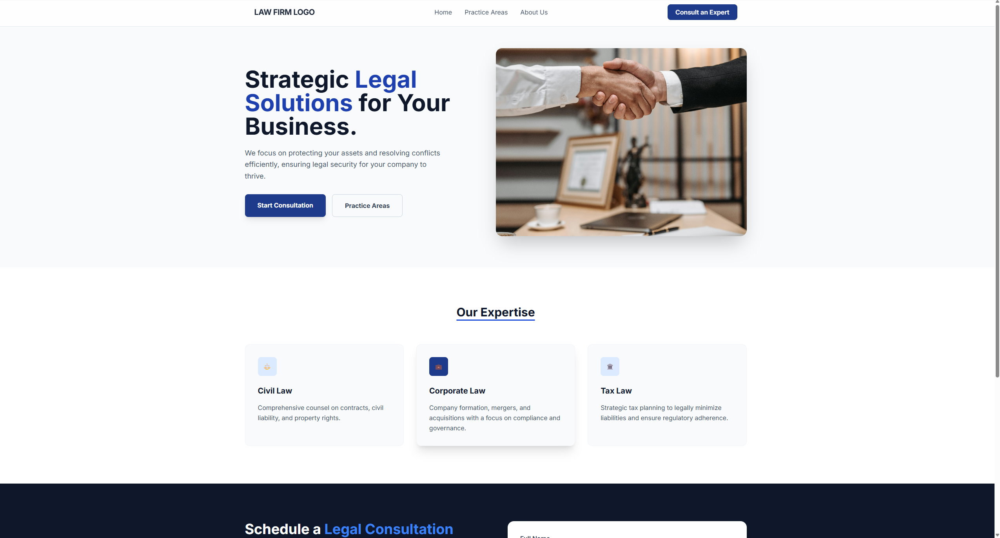

# ⚖️ Premium Law & Consulting Landing Page

[](https://opensource.org/licenses/MIT)
[]([\[LINK_DA_VERCEL_AQUI\]]([https://saas-landing-page-three-puce.vercel.app/](https://legal-landing-page-zeta.vercel.app/)))

This is a high-conversion Landing Page designed specifically for the legal and consulting niche. This project focuses on **high-end visual authority**, **performance**, and **seamless User Experience (UX)**.


---

**🌎 [Live Demo](https://legal-landing-page-zeta.vercel.app/)**

## 🎯 Project Goals
To showcase a professional solution for service-based businesses that need to capture qualified leads. The site is built with a global mindset: it is fully responsive, bilingual, and optimized for paid traffic campaigns (Google Ads / Meta Ads).

## 🚀 Tech Stack
- **HTML5** (SEO-friendly semantic tags)
- **Tailwind CSS** (Modern, utility-first styling for speed and consistency)
- **JavaScript** (Smooth navigation logic and form handling)
- **Formspree API** (Serverless backend integration for lead generation)
- **Google Fonts** (Inter & Montserrat for professional readability)

## ✨ Key Features
- **Smooth Scroll:** Elegant fluid navigation between sections.
- **Bilingual Architecture:** Ready-to-use structure for English and Portuguese versions.
- **Conversion Optimized:** Strategically placed CTA (Call to Action) buttons to drive leads.
- **Secondary Pages:** Custom "Thank You" page (for conversion tracking) and a professional "404 Error" page.
- **Mobile First:** Fully responsive design that looks perfect on smartphones, tablets, and desktops.
- **Clean Code:** Modular-like structure focused on maintainability.

## 📸 Preview
<div align="center">
  
</div>

---

## 🛠️ Local Development

1. Clone the repository:
   ```bash
   git clone [https://github.com/](https://github.com/carolsalome/legal-landing-page)
